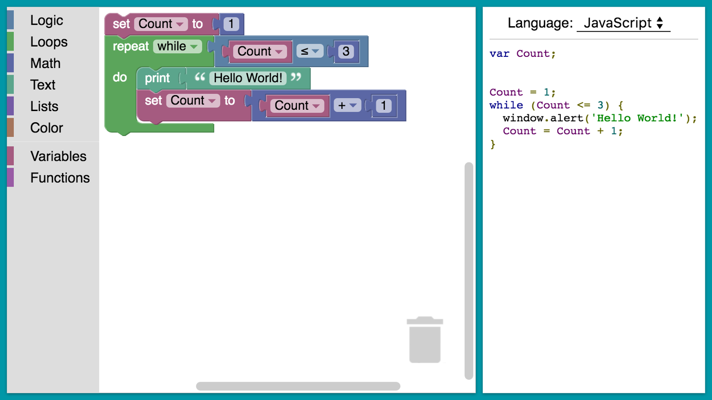
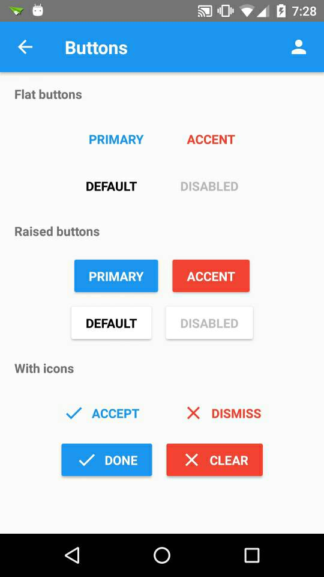

This week Vicky Steeves came in and talked to us again. She talked about the importance of backing up our data. For most students when we add our work to Github we rarely ever think that we need to store our work somewhere else, however Vicky mentioned how even though we add our work to Github, we have to have a copy of it backed up because we never know if something happens to Github then we will lose all our work. This is true for data too, she mentioned how many years ago research data was gone because it wasnt properly stored. She also mentioned briefly about Github Archive Program, where Github says that they'll store multiple copies of open sourced projects in Arctic Vault. Their goal is to preserve open source project so that future generations can use it too. I found this interesting because I never thought that software would constitute as important if civilization were to reset. 

This week I also did 2 project evaluations for Blockly and Material-UI. Blockly is an open source project by Google, it is essentially a library that can be used within a web application. This library adds an editor that allows us to drag blocks that'll produce code based on the language that we choose. The purpose of this is to allow people to not worry about syntax of different programming languages. 

I thought that Blockly was an interesting project to look at since I felt that it was useful, however after the evaluation I dont think that this project is one that I can work on for the semester given that I only have a couple months to understand the code and make contribtutions to. However I do believe that it is could potentially be a project that I would work on in the future. Moreover, based on what I read I believe that the community is very helpful and responds quickly to problems. 

Next I looked at Material-UI. This project is one that I have used before in my previous projects. Material-UI is a React UI framework that helps with rendering React components to make it look nicer without much styling. 

I think this project is one that I am interested in working on and is one that I think is possible to make contributions to within the semester. They have issues that they think would be suitable for beginners, moreover I think that the community is very active and welcoming, constantly responding to questions and merging pull requests. This is definitely one of the projects that I am considering on working on this semester. 
